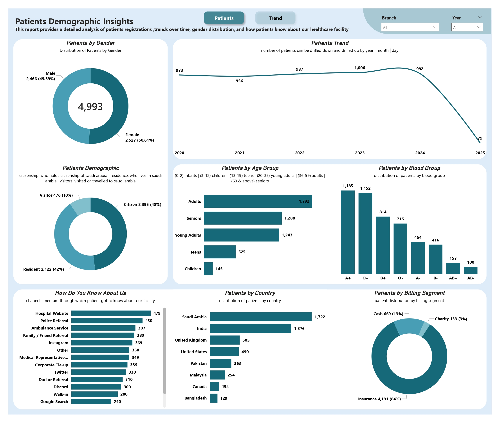
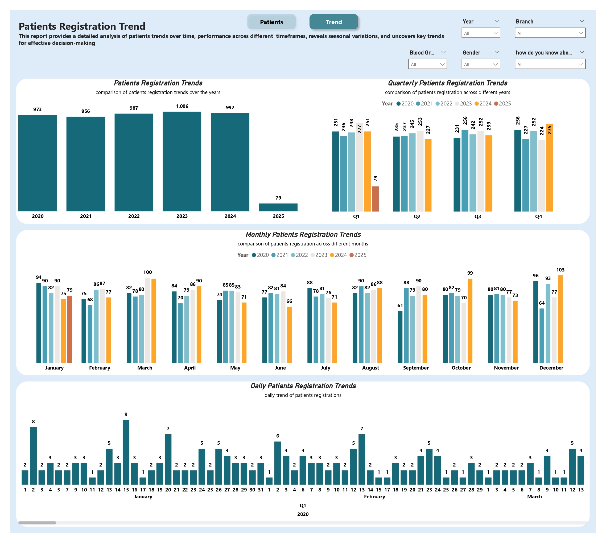

🏥 Patients Demographic & Registration Trends
An Enterprise-Grade Healthcare Analytics Dashboard | Power BI
---
> **"Transforming raw patient registration data into actionable intelligence for healthcare operations, resource planning, and strategic decision-making."**
---
## 📋 Table of Contents

- [Executive Summary](#executive-summary)
- [Problem Statement](#problem-statement)
- [Dashboard Preview](#dashboard-preview)
- [Key Insights & Findings](#key-insights--findings)
- [Technical Architecture](#technical-architecture)
- [Project Documentation](#project-documentation)
- [Repository Structure](#repository-structure)
- [Tools & Technologies](#tools--technologies)
- [About the Analyst](#about-the-analyst)
---
## Executive Summary
This project delivers a two-page interactive Power BI dashboard built on anonymized real-world patient registration data from a multi-branch healthcare facility operating across 2–3 locations. The dashboard spans six years of data (2020–2025) covering a total population of 4,993 registered patients.
The solution enables hospital administrators, operations teams, and healthcare leadership to move beyond static monthly reports and instead interact with a live, filterable intelligence platform — exploring patient demographics, registration volumes, seasonal trends, and referral channel performance in real time.
**Scope at a glance:**

| Metric | Value |
|---|---|
| Total Patients Analyzed | 4,993 |
| Data Period | 2020 – 2025 |
| Dashboard Pages | 2 (Demographics & Trends) |
| Branches Covered | 2–3 |
| Primary Billing Type | Insurance (84%) |
| Data Nature | Anonymized Real Facility Data |
---
## Problem Statement
Healthcare facilities managing multi-branch operations often struggle with a core visibility problem: patient registration data exists in operational systems but is never translated into strategic insight. Leaders are left asking questions that go unanswered:

- Who are our patients — by age, gender, nationality, and status?
- Are patient registrations growing, declining, or plateauing over time?
- Which months and quarters carry the highest patient load?
- How are patients finding out about our facility — and which channels are most effective?
- How is our patient base distributed across billing segments (insurance vs. cash vs. charity)?

This project was built to answer all of the above through a clean, interactive, and executive-ready analytics platform — eliminating the need for manual reporting and enabling data-driven decisions at every level of the organization.

---
## Dashboard Preview
Page 1 — Patients Demographic Insights
> *Demographics breakdown across gender, age group, nationality, residency status, blood group, referral channels, and billing segment.*
<!-- INSTRUCTIONS: Replace the line below with your actual image -->

---
Page 2 — Patients Registration Trends
> *Year-over-year, quarterly, monthly, and daily registration trend analysis with full drill-down capability.*
<!-- INSTRUCTIONS: Replace the line below with your actual image -->

---
## Key Insights & Findings

### 👥 Demographics

- The patient population is nearly evenly split: **Female 50.61% (2,527)** vs. **Male 49.39% (2,466)**
- **Adults (36–59)** form the largest age group at **1,792 patients**, followed by Seniors (1,288) and Young Adults (1,243)
- **Saudi nationals (Citizens)** make up 48% of patients, Residents 42%, and Visitors 10%
- **Saudi Arabia (1,722)** and **India (1,376)** are the top two countries of origin, reflecting the facility's diverse patient base
- **Blood group A+** is most prevalent (1,185), followed closely by O+ (1,152)

### 💳 Billing & Access

- **84% of patients (4,191)** are covered by insurance — indicating strong corporate and institutional ties
- Cash-paying patients represent 13% (669), with charity cases at 3% (133)
- **Hospital Website (479)** is the #1 referral channel, followed by Police Referral (430) and Ambulance Services (387), revealing the importance of both digital presence and emergency partnerships

### 📈 Registration Trends

- Patient registrations remained **stable between 956–1,006 per year** from 2020 to 2024
- **2025 shows only 79 registrations** — reflecting a partial year (data captured through early Q1 only), not a real decline
- **Q4 consistently shows elevated registrations** across most years, suggesting seasonal demand patterns
- Monthly analysis reveals **March and December** as peak registration months in multiple years
---
## Technical Architecture

### Data Pipeline

```text
Raw Excel Data → SQL Queries → Power Query (ETL) → Data Model → DAX Measures → Power BI Visuals
```
### Data Model Highlights

- Data sourced from operational systems and pre-processed using **SQL** for extraction and initial filtering

- **Microsoft Excel** used for data staging and validation before ingestion

- **Power Query** applied for data cleaning: null handling, data type normalization, column standardization, and demographic categorization (age grouping logic)

- **DAX** measures developed for:
  - patient counts by segment
  - year-over-year comparisons
  - quarterly aggregations
  - referral channel rankings
  - billing segment percentages

### Interactivity Features

- **Drill-down enabled** on trend charts:
  - Year → Quarter → Month → Day

- **Cross-page filters**:
  - Branch
  - Year
  - Gender
  - Blood Group
  - Referral Channel

- **Slicers** for dynamic segmentation across all visuals

- **Donut, bar, and line charts** chosen deliberately for audience readability

---

## Project Documentation

A comprehensive project documentation file is included in this repository (`Project_Documentation.pdf` / `.docx`).

It covers:

| Section | Description |
|---|---|
| **Business Requirements** | Stakeholder needs, reporting objectives, and KPIs defined |
| **Data Source Overview** | Description of raw data fields, origin, and anonymization approach |
| **Data Cleaning Log** | Step-by-step Power Query transformations applied |
| **DAX Measures Library** | All calculated measures with formulas and business logic explained |
| **Visual Design Decisions** | Rationale behind chart types, color scheme, and layout |
| **Filter & Slicer Logic** | How cross-filtering and drill-down were configured |
| **Findings & Recommendations** | Analytical conclusions and suggested operational actions |

> 📄 **See:** [`Project_Documentation.pdf`](./Project_Documentation.pdf) for the full technical and analytical write-up.
---
## Repository Structure
```
📁 patients-demographic-registration-trends/
│
├── 📊 Patients_Demographic_Registration_Trends.pbix   ← Power BI project file
├── 📄 Project_Documentation.pdf                       ← Full project write-up
├── 📝 README.md                                       ← You are here
│
└── 📁 screenshots/
    ├── page1-demographics.png                         ← Dashboard Page 1
    └── page2-trends.png                               ← Dashboard Page 2
```
---
## Tools & Technologies

| Tool | Purpose |
|---|---|
|  | Dashboard development, data modeling, visualization |
|  | Data extraction and initial filtering from source systems |
|  | Data staging, validation, and pre-processing |
|  | ETL pipeline: cleaning, transformation, and shaping |
|  | Calculated measures, KPIs, and dynamic aggregations |

---

## About the Analyst

This project was developed as part of a healthcare analytics portfolio demonstrating end-to-end data analysis capabilities — from raw data extraction through to executive-ready visualization.

### Connect with me

- 🔗 LinkedIn: https://www.linkedin.com/in/abrar-analyst/
- 📧 Email: m.abrar4527@gmail.com

---

> 📌 **Note:** All patient data used in this project has been fully anonymized in compliance with applicable data privacy standards. No personally identifiable information (PII) is present in any file within this repository.

---

*Built with Power BI · Analyzed with SQL, Excel & DAX · Documented for recruiters and hiring managers*
